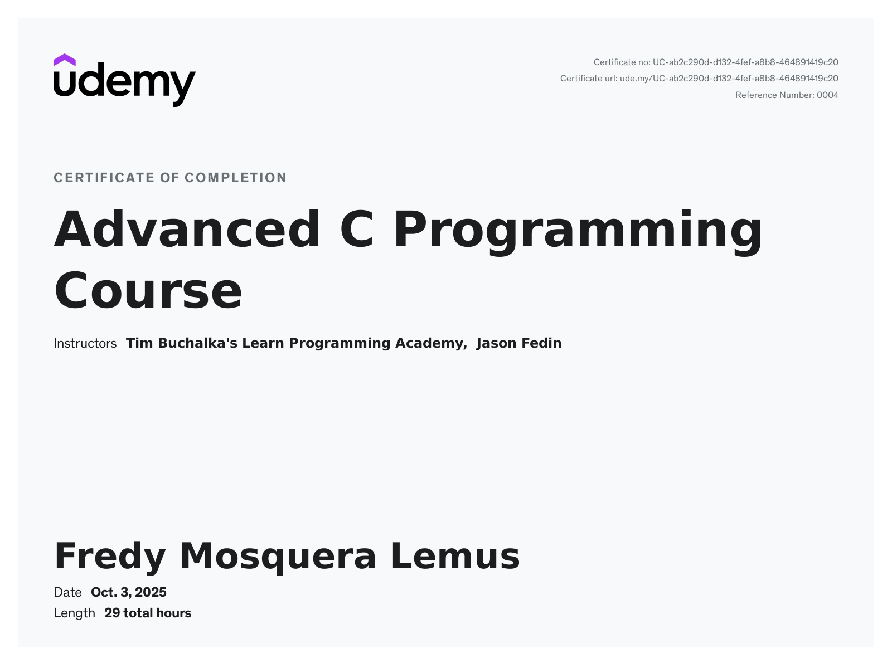

# C Programming Challenges and Assignments

This repository contains all code challenges and assignments completed from the Udemy course:  
**[Advanced C Programming Course](https://www.udemy.com/course/advanced-c-programming-course)**  
by *Jason Fedin*.  

## Repository Structure
- The code files are organized by course sections.  
- Challenges begin from **Section 3**.  
- Each section directory contains the corresponding solutions, following the progression of the course.  

## Notes
- The solutions are written in standard C, following the style and guidelines presented in the course.  
- This repository is intended as a study reference and practice archive for learning C programming fundamentals.  

# Certificate of Completion
 - Link:https://www.udemy.com/certificate/UC-ab2c290d-d132-4fef-a8b8-464891419c20/
 